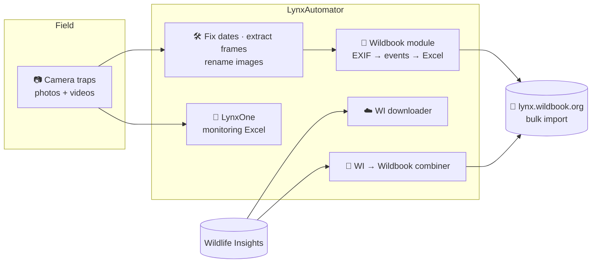

<div align="center">


# LynxAutomator

### Desktop toolkit to automate camera-trap data workflows for Iberian lynx monitoring

**From raw camera-trap folders and Wildlife Insights exports to Wildbook-ready bulk-import Excel files, without hand-editing spreadsheets**

[](https://github.com/antonalvarezbc/LynxAutomator/releases)
[](https://github.com/antonalvarezbc/LynxAutomator/releases)
[](https://www.python.org/)
[](https://github.com/TomSchimansky/CustomTkinter)
[](#-download--install)
[](#-languages)
[](LICENSE)

### ⬇️ [Download the latest release](https://github.com/antonalvarezbc/LynxAutomator/releases) · 🌐 [Try the WI → Wildbook module online](https://lynxautomator-wi-wb.streamlit.app/)

</div>

---

## 📖 Table of contents

- [Why LynxAutomator](#-why-lynxautomator)
- [Modules](#-modules)
- [How it fits in the workflow](#-how-it-fits-in-the-workflow)
- [Download & install](#-download--install)
- [Run from source](#-run-from-source)
- [Build the executable](#-build-the-executable)
- [Languages](#-languages)
- [User guide](#-user-guide)
- [License](#-license)

---

## 🌍 Why LynxAutomator

Iberian lynx monitoring produces thousands of camera-trap photos and videos every season. Before they can be used for individual identification in **[Wildbook](https://lynx.wildbook.org)**, someone has to group the photos into events, extract dates from EXIF data, fix cameras that were set with the wrong clock, rename files and fill in Wildbook's bulk-import spreadsheet column by column.

**LynxAutomator bundles all those chores into one desktop app.** Field technicians pick a folder or a CSV, set a couple of options and get the output file. No Python or spreadsheet formulas required. It was built for the Iberian lynx, but most tools work for any species.

## 🧰 Modules

The app is organised in tabs, one per module:

| | Module | Tool | What it does |
|---|---|---|---|
| 🐾 | **Wildbook** | Folder → bulk import | Reads image dates from EXIF (`DateTimeOriginal`), groups photos taken within a configurable **time threshold** into one encounter (`Encounter.mediaAsset0…N`) and fills date columns in a Wildbook bulk-import Excel |
| | | Catalogue → bulk import | Builds a bulk-import Excel from a catalogue folder, one row per individual (`MarkedIndividual.individualID`) with all its images as media assets |
| ☁️ | **Wildlife Insights** | Image downloader | Takes a Wildlife Insights CSV export and downloads the images with `gsutil`, organised into one folder per deployment |
| 🔗 | **Wildlife Insights → Wildbook** | CSV combiner | Merges Wildlife Insights CSVs into a Wildbook bulk-import Excel, grouping images into events by time threshold and generating `Occurrence.occurrenceID`. Also available [online](https://lynxautomator-wi-wb.streamlit.app/) |
| 🐆 | **Iberian Lynx** | LynxOne | Scans a revision folder tree (with optional *Lince/Linces* and *Revisión* sub-folders), groups images by minutes and generates the monitoring Excel, optionally joined with *Stations* and *Individuals* files |
| 🛠️ | **Functionalities** | Date changer | Shifts the capture date of every image in a folder when a camera trap was set up with the wrong date/time |
| | | Video frame extractor | Extracts frames from videos at a chosen interval (seconds) and writes the original capture date into each frame's EXIF |
| | | Image renamer | Bulk-renames images using the folder name, optionally keeping the original file name |
| ℹ️ | **About** | | Presentation, credits and logo |

## 🔄 How it fits in the workflow



## ⬇️ Download & install

Grab the files from the **[Releases](https://github.com/antonalvarezbc/LynxAutomator/releases)** page.

| Release | Files | Notes |
|---|---|---|
| **v0.0.2.alpha** (latest) | `LynxAutomator-Setup.exe`, `LynxAutomator_v002alpha.exe`, `LynxAutomator_Portable.zip` | Windows |
| v0.0.1.alpha | `LynxAutomator-Setup.exe`, `LynxAutomator_v001alpha.exe` | Windows |
| *Pre-release* | Windows, macOS (Intel / Apple Silicon) and Linux builds, with `SHA256SUMS.txt` | 🧪 Experimental cross-platform builds |

**Two ways to run it on Windows:**

- **Portable** (`LynxAutomator_v00Xalpha.exe` or the `_Portable.zip`): no installation, just double-click.
- **Installer** (`LynxAutomator-Setup.exe`): same app, installed in *Program Files* with Start-menu and optional desktop shortcuts.

> [!WARNING]
> Some antivirus programs flag PyInstaller executables as suspicious. If that happens, add LynxAutomator as an exception, or pause real-time protection during installation and turn it back on afterwards.

## 🐍 Run from source

The main branch targets **Windows** (it uses `pywin32` to set file creation dates).

```bash
git clone https://github.com/antonalvarezbc/LynxAutomator.git
cd LynxAutomator

pip install customtkinter pandas openpyxl pillow opencv-python piexif pywin32
python LynxAutomator_v001alpha.py
```

The **Wildlife Insights downloader** also needs the [Google Cloud CLI](https://cloud.google.com/sdk/docs/install) (`gsutil`) installed and on your `PATH`.

## 📦 Build the executable

```bash
# 1. Single-file executable with PyInstaller (full command in "PyInstaller Code.txt")
pyinstaller --clean --onefile --windowed --icon=favicon.ico \
  --hidden-import=customtkinter --hidden-import=cv2 --hidden-import=piexif \
  --hidden-import=win32file --hidden-import=pywintypes \
  LynxAutomator_v001alpha.py

# 2. Windows installer with Inno Setup
#    Open LynxAutomator.iss and update the Source path to your dist/ folder
iscc LynxAutomator.iss
```

### Repository contents

```text
LynxAutomator/
├── LynxAutomator_v001alpha.py        # Main app (all modules)
├── LynxAutomator_v001alpha mini.py   # Earlier, lighter version of the app
├── PyInstaller Code.txt              # Full PyInstaller build command
├── LynxAutomator.iss                 # Inno Setup installer script
├── WIP LynxAutomator GUIDE .docx     # User guide (work in progress)
├── logo.png, favicon.ico
└── LICENSE                           # GPL-3.0
```

**Stack:** `customtkinter` · `tkinter` · `pandas` · `Pillow` · `piexif` · `opencv-python` · `pywin32` · `gsutil`

## 🌐 Languages

The interface is available in **Español** (default), **Português** and **English**, and can be switched from inside the app.

## 📘 User guide

A step-by-step guide is available as a Word document: **[LynxAutomator GUIDE (WIP)](https://github.com/antonalvarezbc/LynxAutomator/blob/main/WIP%20LynxAutomator%20GUIDE%20.docx)**.

## 📜 License

Released under the **[GNU General Public License v3.0](LICENSE)**.

---

<div align="center">

Made by **[Antón Álvarez](https://github.com/antonalvarezbc)** for Iberian lynx conservation 🐆

</div>
